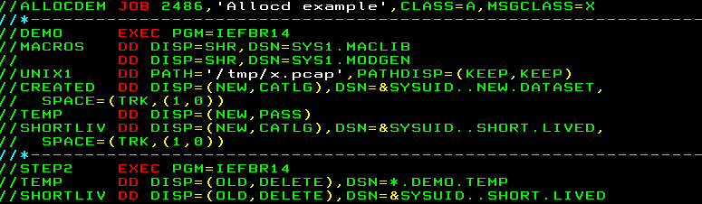
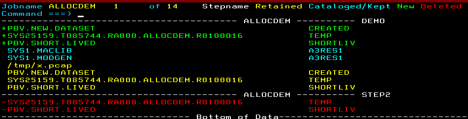

# ISPF Tools mostly written in Rexx #

This is a work-in-progress.  Please report all errors.  I'm happy to accept pull requests to improve the code and fix bugs.

### ALLOCD Instructions ###

Submit a job, for example:

Wait for it to complete, then in SDSF held output:

- Put a `?` next to the job whose data sets you want to browse or view
- Use line command `SV` or `SE` (*not S*) on the JESYSMSG line

- Issue primary command `ALLOCD` with optional filters:

`ALLOCD {N} {data set filter}`

Both parameters are optional. Parameter order does not matter

Examples

- `ALLOCD`          No filter
- `ALLOCD N`        Do not list temp DSNs
- `ALLOCD SYS`      List only DSNs matching 'SYS'
- `ALLOCD N SYS`    List DSNs matching SYS but not temp DSNs
- `ALLOCD FRED N`   List DSNs matching 'FRED' but not temp DSNs

Once the data sets and UNIX files are listed, position the cursor
on the item you wish to examine then hit ENTER to browse or F10 to view.

