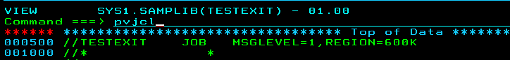
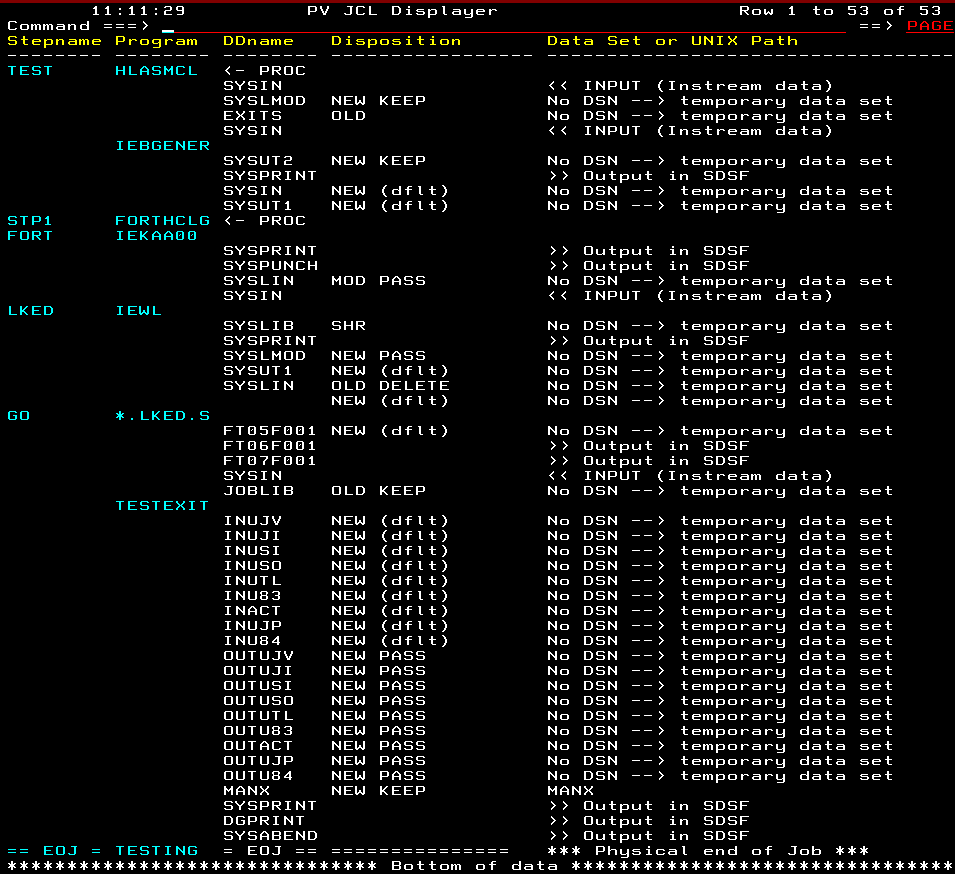
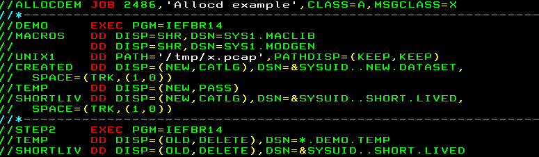
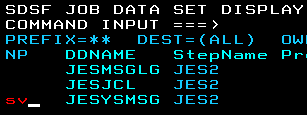
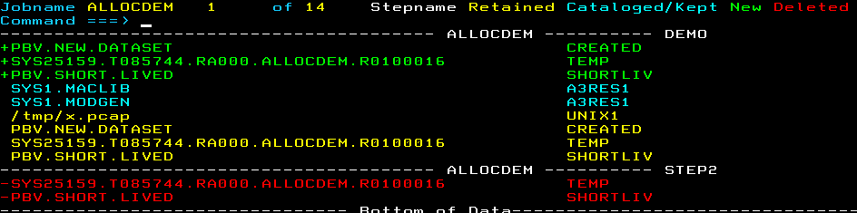
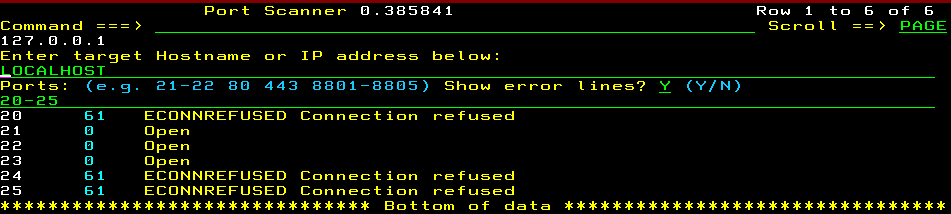

# ISPF Utilities #

This repository is a rather eclectic collection of some Rexx routines I've written because I've either needed them, or just for fun.
Please feel free to ask me anything about them, and of course copy them for your own purposes.
If you fix or improve anything here then please collaborate!

I don't ike writing huge programs, so most of these routines are quite small. Some are edit macros, others are a bit more involved, such as
CPUPCT, PVJCL, ALLOCD, PORTSCAN and PL.

This is a work-in-progress.  Please report all errors and omissions. If you need more documentation please let me know.

A huge thanks to Lionel Dyck for being such an inspiration.

## PVJCL ##

### Function ###

Ever had to maintain someone else's JCL?  Find it daunting when there are a lot of steps?  PVJCL to the rescue! This edit macro will display the
member you are editing or viewing in a way that is easier to understand.  Essentially, it gives you an overview.

### Known limitations ###

It does not expand PROCs.

### Instructions ###

Edit or view some JCL, e.g. **SYS1.SAMPLIB(TESTEXIT)**. Enter `PVJCL` as a primary command

## ALLOCD ##

### Function ###

Ever wondered what files (data sets) a job used?  ALLOCD to the rescue! It will list all the data sets (and UNIX files) that were allocated during
the running of a job, what their disposition was, and allow you to browse view them if they still exist.

### Instructions ###

Submit a job, for example:

Wait for it to complete, then in SDSF held output:

- Put a `?` next to the job whose data sets you want to browse or view
- Use line command `SV` or `SE` (*not S*) on the JESYSMSG line

- Issue primary command `ALLOCD` with optional filters:

`ALLOCD {N} {data set filter}`

Both parameters are optional. Parameter order does not matter

Examples

- `ALLOCD`          No filter
- `ALLOCD N`        Do not list temp DSNs
- `ALLOCD SYS`      List only DSNs matching 'SYS'
- `ALLOCD N SYS`    List DSNs matching SYS but not temp DSNs
- `ALLOCD FRED N`   List DSNs matching 'FRED' but not temp DSNs

Once the data sets and UNIX files are listed, position the cursor
on the item you wish to examine then hit ENTER to browse or F10 to view.

## PORTSCAN ##

### Function ###

Ever wondered what server ports are reachable from your mainframe? Been asked by the network guys to check connectivity to a certain port?
PORTSCAN to the rescue!

### Known limitations ###

Some connection attempts take a long time to time out. Be patient!  It shouldn't take more than a minute.

### Instructions ###

Type `TSO PORTSCAN`

Enter values for Hostname or IP address and Ports and either Y or N in `Show error lines?` then hit enter.

